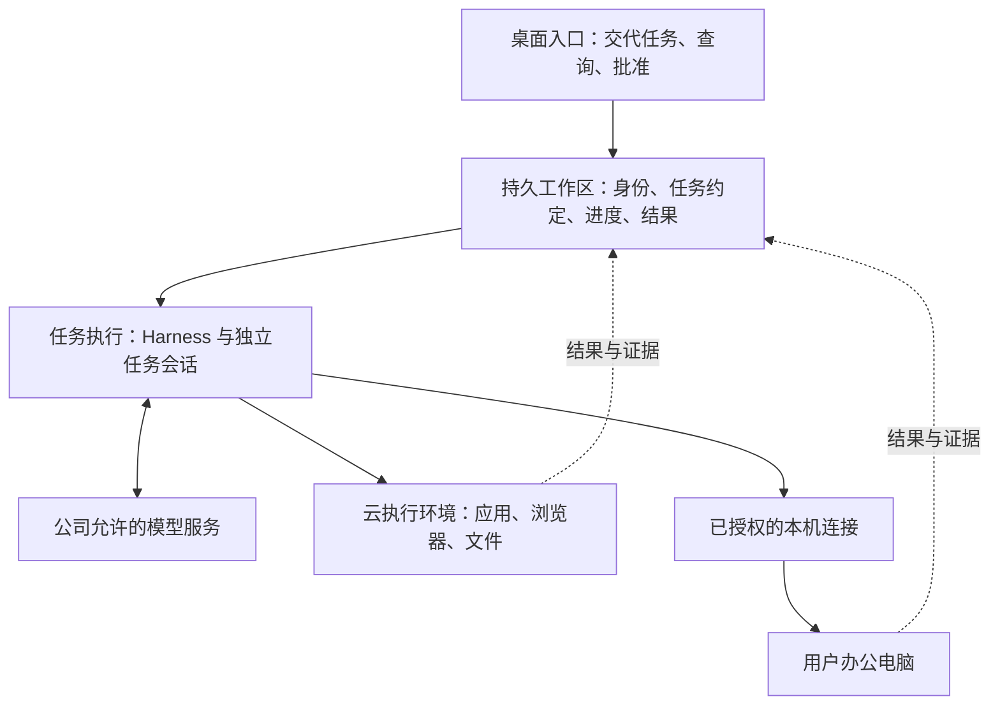

# 锐捷 Bot：持续任务助手的产品形态与架构决策

2026 年 9 月 21 日 · 产品方向评审稿

**评审对象：** 面向公司内部知识工作者的完整桌面 AI 产品，既能持续完成云端任务，也能操作用户办公电脑。首批用户范围已确认；具体高频任务、使用意愿与收益仍需验证，本文中的用户故事是设计推演，不是已完成的用户访谈。

**阅读方式：** 第 1 节用于决策汇报；第 2—7 节解释选择；第 8—9 节支持研发拆解与阶段评审。源码事实和外部产品证据在文末单独索引。所有目标行为均为建议，不能视为现有版本已实现。

## 1. 建议决策：围绕“可托付的任务”建立产品，而不是围绕引擎建立产品

建议把锐捷 Bot 定义为：**用户交代目标后，能够记住约定、选择合适的工作环境、持续推进，并把结果或阻碍交代清楚的个人工作助手。**

它的核心价值是让一部分工作不再依赖用户持续盯着聊天窗口。电脑操作、长任务和定时任务是实现这一价值的能力；模型和 Harness 是产品内部的实现选择。

| 决策 | 建议 | 产品上的含义 |
|---|---|---|
| 助手归属 | 以持久工作区承载 Bot 身份、任务和结果 | 换设备、换执行进程、更新云电脑，不应等于换了一个助手 |
| 任务托管 | 云端工作区负责已接收的托管任务；首版可以与执行器同机部署 | 本机关机后，已有托管约定仍有效；不要求一开始建设大型云平台 |
| 执行环境 | 任务记录与可重建的操作环境分开管理 | 重装云电脑不能把日程、任务历史和结果索引一起重装掉 |
| 聊天与执行 | 一个产品身份，允许多个独立任务会话 | 用户不用面对“聊天机器人”和“干活机器人”两套互相甩任务的界面 |
| 本机能力 | 云端任务通过已授权的本机连接执行；独立本地任务保留自己的责任归属 | 能操作本机不等于必须先让本地模型当总指挥 |
| 引擎与模型 | 锐捷 Harness 为优先验证候选，Codex 为有条件替代；产品统一管理模型策略 | 不让普通用户挑引擎、填模型参数或安装 CLI |

这不是要求“把所有能力搬到云端”。**用户交互在桌面，任务责任在工作区，动作发生在目标电脑，模型推理由获准的模型服务提供。** 四者可以分开部署，也可以在初期部分合并。

有三项应当本轮定下来：任务必须有唯一归属；执行环境更新不得改变任务归属；用户购买的是完整能力而非引擎选择器。有三项应保留验证空间：首批任务中本机依赖的比例、Harness 的目标服务器运行条件、是否值得长期保留默认内置的本地执行器。

## 2. 先确定产品承诺，再判断是否需要云端

### 2.1 首批场景应当兼顾价值与可交付性

建议优先服务“重复资料整理、周期性汇报、跨应用信息加工”的知识工作者。原因是这些工作既有明确交付物，也能逐步从人工监督转成稳定托管；用户容易判断是否真的节省了工作。

首批不应以“任意网站、任意软件、任意复杂任务都可全自动完成”为承诺。这样的目标会把环境兼容、视觉操作和业务判断的所有不确定性同时推给产品。

| 场景族 | 用户真正购买的价值 | 是否应优先 |
|---|---|---|
| 每日信息巡检、资料整理、定时生成报告 | 不需要自己记得打开软件并发起工作 | 优先，适合验证托管和结果交付 |
| 本机文件与在线资料结合，生成办公产物 | 减少跨窗口搬运和重复加工 | 优先，但需显式处理文件来源与本机离线 |
| 公司内网业务操作 | 复用办公身份、网络和应用环境 | 选一个受控流程试点；不能承诺关机后仍能访问本机内网 |
| 完全开放的长链桌面操作 | 替代人工处理复杂界面 | 后续扩大，先证明可观察、可停止、可恢复 |

本轮最重要的业务验证不是“用户喜欢哪个模型”，而是：**哪些任务用户愿意提前托付，哪些必须在本机完成，哪些结果值得持续付出云资源成本。**

### 2.2 五项可感知承诺

1. **交代有凭据。** 用户能看到任务已被哪一个工作区接收、何时执行、结果到哪里；模型回复“好的”不等于托管成功。
2. **关机有边界。** 已接收且不依赖本机的任务继续；依赖本机的步骤显示等待，不把“离线可运行”无限扩大。
3. **过程可干预。** 用户能询问进度、补充要求、暂停或接管电脑；干预指向具体任务。
4. **结果可核对。** 完成意味着有可访问的产物或业务回执；失败意味着说明阻碍和下一步。
5. **升级不失约。** 更换模型、引擎、客户端或云电脑时，已有任务和结果有明确的保留与恢复规则。

这些承诺决定后续架构。仅把一条定时命令放到服务器上，可以解决“到点启动”；不足以独立兑现其余四项。

### 2.3 对未来形态的判断：从一次提示，演进为可持续管理的工作约定

值得探索的方向，是用户逐渐从“告诉 AI 每一步怎么做”，转向“约定结果、输入、时间和授权范围”。例如日报跑通后，用户维护的是信息源、报告标准和例外处理，不必每天重复描述同一套步骤。完成记录与人工纠正应帮助改进下一次执行，但不能未经用户确认就改变业务目标或扩大授权。

这意味着产品长期积累的资产是：可复用的任务定义、获准的企业连接、稳定的执行环境，以及经过结果验证的工作方法。引擎或模型升级可以改善这些资产的执行效果，不应让用户重新建立全部工作关系。

建设顺序应是单次交办可交付、重复工作可托管，再发展多任务协作。先从结构化应用接口解决可稳定执行的部分，桌面操作覆盖缺少接口的流程；不要让每一项工作都必须经过截图和鼠标。协作也不等于增加更多聊天角色，只有任务确实需要并行专长且收益超过交接成本时，才增加内部执行者。

这是战略假设，仍需用持续采用验证。如果用户反复要求重新手工执行、不愿把同类任务继续托付，或维护流程比亲自完成更费力，产品应先收窄场景，不能以“未来 AI 都会这样”替代证据。

## 3. 任务托管在哪里：远程执行机与云端后台究竟有什么区别

### 3.1 直接把任务放在远程执行机上，是成立的方案

可以在一台长期在线的远程电脑上部署 Bot 后台、定时器、Harness、浏览器和文件目录。只要机器和相关进程运行，本机关机不会阻止它工作。**“没有另一台后台服务器”并不意味着无法做定时托管。**

真正的区别是：当这台远程电脑休眠、损坏、重建、迁移或需要换执行器时，任务约定和操作环境是不是一起失效。

| 路线 | 怎么运行 | 获得什么 | 承担什么 | 适用判断 |
|---|---|---|---|---|
| A 本地总管＋远程工具 | 本地 Bot 记任务、调用模型，再操作远程电脑 | 最接近当前桌面路径，本机操作自然 | 本地离线影响未来触发；远程电脑常驻不能替代本地调度 | 适合在场协助，不能作为持续托管的默认路线 |
| B 一体化远程工作机 | 后台、引擎、任务数据与桌面环境全部放在同一环境里 | 建设最快，固定容量时容易管理 | 机器故障、重建和休眠影响整套能力；恢复与升级耦合 | 可做验证样机，也适合用户明确接受停机的专用部署 |
| C 托管工作区＋可替换执行环境 | 任务管理与执行环境有独立生命周期；初期仍可同机 | 保留简单部署，同时为恢复、扩容和环境更新留下路径 | 要补任务领取、结果回传、持久数据和权限分工 | **建议产品路线** |
| D 本地智能总管＋云端智能执行者 | 本地模型理解需求并向云端模型派发任务 | 本地专长和云端能力都可独立发展 | 增加上下文交接、重复判断、责任同步和离线后的指挥权问题 | 有强本地决策需求时再考虑，不宜默认引入 |

路线 C 的“分开”首先是职责、权限和数据生命周期的分开，不是立即购买两台服务器。首版可以在一台受控主机里，让工作区后台长期运行，执行器运行任务，浏览器或桌面在受限环境内操作。任务记录保存到不会随操作环境重建而清空的位置，并有机器之外的备份。

**这种同机部署可以隔离环境重建的影响，却不能消除整台主机故障。** 初期若没有故障切换能力，应按“故障后可恢复”验收，不能宣传“故障时不中断”。将来需要桌面休眠、多个执行环境或更高可用性时，再将后台物理独立部署。

隔离成立还需要具体约束：执行账号不能改写任务记录，环境重建只作用于指定范围，执行盘写满不能拖垮任务存储。“已接收”的保证也必须与存储方式一致：仅本机落盘只能覆盖相应故障范围；若正式承诺整机丢失后已接收的约定仍不丢失，就要在确认前完成覆盖该故障范围的持久保存。周期备份可能丢失最近记录，不能在措辞上省略这一差别。

### 3.2 两种部署在同一个用户故事中的差别

用户设定“每天 8 点整理行业动态”。如果远程执行机持续在线，路线 B 与 C 都能完成，用户看不出差异。

随后用户在 7:55 更新云电脑：

- **路线 B：** 如果定时器也在被重建的环境中，8 点可能无人触发；恢复后需要判断补跑还是跳过。如果任务数据也在该环境里，还涉及找回约定。
- **路线 C：** 后台保留日程，知道执行环境正在更新；到点后记录“等待环境”，待健康检查通过再执行，或者按事先约定错过即跳过。若后台与桌面同机而整机重启，仍会暂停调度，但恢复后应保留同样的处理依据。

因此，选择 C 的理由不是“云端后台更高级”，而是产品未来要支持更新、故障恢复和不同执行环境时，不应重新设计任务归属。

### 3.3 不需要让整个 AI 全天运行

需要持续可用的是任务记录、调度触发和状态入口。Harness 可以在有任务时启动或保留一定时间的会话；模型按请求推理；云桌面只有需要浏览器或图形操作时才必须可用。

“一直记得约定”和“一直运行昂贵的桌面与模型调用”是不同成本。首版可以保持环境常驻以减少变量，后续再验证休眠、预热和恢复时间，不能先承诺即时唤醒又未经测量。

图示是职责划分。首版工作区后台与执行器可以同机部署；操作环境要限制其修改任务记录和系统凭据的能力。桌面入口发给云端的任务，不需要先经过本地 Harness。

### 3.4 公司统一管理，不等于所有用户共用一台桌面

首版建议按用户分配独立工作区；同一用户的多个 Bot 可以复用获准的数据与工具，但每项任务各有记录，同一可见桌面的操作必须排队。不同用户的账号、浏览器登录、文件和任务不能因共用服务器而混在一起。

公司统一管理账号准入、工作区分配、版本、用量和资源限额；每个工作区保管自己的任务与执行状态。先把少量独立工作区运转好，再增加自动开通和弹性分配。团队共享工作区属于后续明确授权的产品能力，不能把“共享一个工作目录”当成已完成的团队协作。

## 4. 一个助手、几个模型、分别在哪里

### 4.1 “助手活在哪里”需要拆成四个可回答的问题

| 用户感知的对象 | 建议放在哪里 | 为什么 |
|---|---|---|
| Bot 的身份、任务承诺、可用记忆和结果 | 它归属的持久工作区；托管模式部署在公司或获准的云环境 | 不随聊天窗口、执行器进程消失 |
| 正在理解与推进某项任务的执行过程 | 工作区分配的 Harness 运行环境，靠近主要工具与数据 | 便于持续执行；它可以与云电脑同机，也可以独立 |
| 大模型推理 | 公司允许的模型服务或私有推理环境 | “本地装 Harness”不等于“模型权重在本机” |
| 点击、读文件、操作应用 | 任务指定的云电脑或已授权本机 | 动作位置由业务需要和权限决定 |

建议初期让云端工作区的同一套执行体系同时承担对话与任务推进，不额外建设“只会聊天的前台模型”。但**不要让整个 Bot 只有一条执行会话**：日报任务正在工作时，用户仍应能够查询状态，必要时创建另一个任务。现有代码已经有独立任务及 provider 会话的基础，不应重新退回单聊天流。[S4]

同一 Bot 的多个任务可共享经管理的长期偏好和身份，不自动混用所有临时上下文。每个任务应保留自己的目标、输入版本、已完成步骤、权限和产物。跨模型或跨引擎继续时，交接这些明确记录，不能假设能够搬运另一套引擎的全部内部状态。

### 4.2 “统一”体现为四个产品规则

- **统一入口：** 用户从同一产品发起、查询和修改任务，不需要先选择哪套引擎。
- **统一责任：** 一个任务只有一个权威记录和当前负责人，不因用户开关机自动换归属。
- **统一结果：** 工作区汇总最终结果、证据和需要用户处理的事项，模型自行说“完成”不能直接盖过工具失败。
- **统一权限：** 更换模型、继续会话或转交子任务，不自动扩大数据范围和电脑操作权限。

统一不是所有任务强制使用同一个模型，也不是所有工作必须塞进同一条对话。

### 4.3 模型可以切换，但应由产品承担复杂度

建议用有限的、经过验证的能力策略，替代向用户开放完整模型目录：

| 工作阶段 | 产品策略 | 不应发生的行为 |
|---|---|---|
| 查询已有任务状态 | 优先读取确定的任务记录；必要时由模型组织表达 | 为回答“做完了吗”重新启动一次完整任务 |
| 普通理解、摘要、结构化工具操作 | 使用达到质量要求的基础策略 | 为降低单次调用成本忽略总重试成本 |
| 需要视觉识别或复杂纠错 | 转入已验证的专长策略，保持任务编号和约束 | 让无相应输入能力的模型反复猜界面 |
| 达到失败、时长或成本阈值 | 有限升级能力，或明确请求人工处理 | 无限切模型、无限重试，掩盖失败 |

第一版只需少量策略和明确升级条件，不必建设开放式“模型自动竞赛”。切换原则上发生在新任务或可记录的阶段结束处；需要会话内切换时，必须验证当前引擎适配是否支持。执行环境和已有权限不因模型切换而改变。

**本地执行也不自动等于数据不出本机。** 本地 Harness 如果调用外部模型，发送的文件内容、截图或上下文仍会离开本机。需要数据留在公司内时，应同时约束执行位置、模型端点和允许发送的数据，不能用“本地模式”替代这三项说明。

## 5. 本机究竟封装什么，云端究竟选择谁

### 5.1 本机安装包应交付完整体验

本机至少包含桌面界面、登录与工作区连接、任务进度与审批、本机文件和电脑操作连接、停止与人工接管、更新和故障诊断能力。用户不应为了使用这些能力再去安装 CLI 或处理运行时依赖。

对现有产品，建议**首阶段保留已经内置的锐捷 Harness 作为独立本地执行能力**，托管任务不经过它转发；仅因云端不可达，也不自动由它复制执行云端任务。后续若数据显示独立本地任务很少，再考虑标准安装包精简、按需安装本地执行模块；公司离线分发包仍可以提供完整模块。

这同时回答了“本地该不该封装引擎”：需要独立本地执行时应封装，但云端任务能操作本机，本身并不构成必须启动本地引擎的理由。

首版明确保留两个工作区归属：托管任务由云端工作区保存；独立本地任务由本地工作区保存。界面可以统一展示入口，但须标记归属。本地记录若以后向云端同步，先只展示带时间标记的摘要，不自动合并长期记忆，不改变任务负责人。独立于云工作区不代表无需联网：本地引擎调用远端模型时仍依赖模型服务可达。

建议用户只看到与决策有关的选项：使用哪台电脑、哪些资料可以提供给任务、什么动作需要批准。引擎名与模型版本放在管理和诊断界面，不占据日常任务入口。

### 5.2 Harness 与 Codex 是同层候选，App Server 不是另一种云平台

Codex CLI 本身也是一种 Agent 运行时，可以承担这里所说的 Harness 职责。`codex exec` 适合非交互执行，SDK 用于程序化集成，App Server 面向更丰富的会话和交互控制；它们都不能自动替产品实现账号体系、持久任务调度、电脑资源分配和结果交付。

**已有源码实际接法：** 锐捷走本机 Host 的 HTTP/WebSocket 接口；Codex driver 走 App Server。二者都有电脑工具适配基础。不要把 Codex 的“Server”名称理解成已经具备公司级任务托管后台。[E1]

| 决策维度 | 锐捷 Harness | Codex 路径 | 对本项目的判断 |
|---|---|---|---|
| 现有产品接入 | 已有公司登录、内置分发、工具和模型选择接入 | 已有 App Server driver 与工具适配 | 二者都不是从零接入；锐捷更接近当前封装基础 |
| 公司账号与模型政策 | 已有 OAuth 刷新实现；服务器无人值守与撤销处理仍要验 | 当前适配走 ChatGPT 登录，且清除 API key 环境变量；企业接法仍需建设或验证 | 属于硬门槛，优先于某个演示任务的效果 |
| 云端运行形态 | 已有无窗口 Host；Bot 内置产物覆盖 Windows/macOS | 可作为服务器执行器候选，需固定所用版本与接口 | 应比较实际可交付产物，不比较名字 |
| 能力切换 | 当前 Bot driver 声明会话内换模能力 | 当前 Bot driver 将会话内换模标为不支持 | 是当前适配差异，不能推导 Codex 原生永远不支持 |
| 电脑操作与恢复 | 工具已接，但可靠性须按任务测 | 同样须按任务测 | 引擎、模型、工具和环境共同决定效果 |
| 版本与维护 | 要对齐源码、固定提交、桌面包与云端包 | 要固定 CLI/协议版本并验证升级兼容 | “同叫一个版本”不能代替可追溯的构建清单 |

**建议采用有否决条件的 Harness 优先策略。** 理由是本项目已有公司接入和封装投入，并存在模型策略管理的适配基础；不是已经证明它比 Codex 更强。满足目标服务器部署、身份续期、工具控制、取消恢复、任务隔离这五项条件后，优先让本机和云端共用同一引擎体系，但可以使用不同发行形态。

若 Harness 在目标平台或公司认证上有无法接受的障碍，或相同任务中稳定性持续不达标，再比较 Codex 的可交付方案。切换不应以“有一篇自动执行文档”为依据，也不应为了名义统一而长期承担明确的能力缺口。

为避免“优先验证”变成无限期投入，阶段一开始前必须固定目标操作系统、认证方式、共同任务集、资源条件、双方可投入的验证期限和发布阻断项；到期提交继续使用、改候选或缩小承诺的结论。未达门槛时，不能以“再调一调”自动延长默认选型。具体期限由项目负责人按资源确认，本稿不虚构日期。

引擎选定前的验证必须使用同一批任务、同等数据与权限。能使用相同模型时分别比较运行时差异；不能时，应明确比较的是两套完整方案，不能把模型差距归因给 Harness。费用比较包括失败重试、人工接管、环境运行与维护成本，不只比较 token 价格。

还有一个实现风险不能省略：锐捷现有桌面无窗口 Host、底层一次性 headless 程序、JSON-RPC SDK 是三条不同接入路径。当前 SDK 文档存在逐任务取消与结果归属的限制，不能假设把桌面包换成 SDK 就完成轻量云化。当前 Bot 固定的 Harness 提交与本机另一份 Harness 源码也不一致，尚未确认差异；应以最终发行产物验收，而非凭相同的版本号推断能力。[E1]

## 6. 六条用户旅程：让选择落实到真实行为

以下为设计用的用户故事，不是假装已访谈到的案例。它们同时用于发现架构遗漏和组织验收。

### J1 每天上班前，报告已经准备好

**目标：** 员工设定“工作日 8:30 汇总指定网站动态，生成报告放到工作区”。

**旅程：** 用户说明目标 → Bot 确认来源、时区、工作日范围和交付位置 → 工作区保存计划并返回托管凭据 → 用户关机 → 到点创建本次执行记录 → 获取资料并生成报告 → 用户次日打开产品看到结果和来源。

**关键判断：** 定时器属于工作区，执行器只承担本次任务；“8:30”默认是开始执行时间，如用户要求 8:30 前交付，产品需区分截止时间并估计提前启动。每次执行使用当次计划版本，不能让后来编辑覆盖历史。

**异常与验收：** 网站不可访问时给出失败或部分结果；身份过期显示需要重新连接；错过时间按任务约定补跑或跳过。用户能区分“已保存计划”“已经开始”“结果已交付”，客户端关闭不取消已接收任务。

### J2 晚上用本机表格，第二天拿到分析

**目标：** 用户说“结合桌面这份 Excel 和网上资料，明早给我分析”。

**旅程：** 产品定位具体文件 → 告知后台执行需要可持续访问的输入 → 用户允许保存这一版到获准工作区，或选择等待本机在线读取 → 生成任务 → 在云环境加工 → 交付报告并注明使用的文件版本。

**关键判断：** 关机连续性首先取决于依赖是否已经准备好。若文件已按授权复制且任务没有后续本机依赖，本机即可关机；若必须实时读本机最新版，产品应显示依赖和等待期限。

**异常与验收：** 同名文件变化不能悄悄替换输入；传输未完成不得宣称“现在可以关机”；禁止上传的资料，应使用获准的本地或公司内处理路径，无法满足则明确说明。不能靠两套 AI 相互聊天解决文件不可达。

### J3 在公司业务系统里更新记录，用户仍能掌控办公电脑

**目标：** 用户要求从内网应用取数，核对后更新一条记录。

**旅程：** 优先检查是否有获准的应用接口 → 必须使用桌面时绑定到指定办公设备 → 展示读取、截图和修改范围 → 用户授权 → 执行前取得该桌面的使用权 → 读取核对 → 按规则批准业务修改 → 回传业务回执。

**关键判断：** 云端助手可以负责整个任务，本机连接负责执行和返回结果，不必再启动一个本地模型。但如果要求截图和数据不得离开某个范围，必须选择满足该要求的运行环境与模型服务。

**异常与验收：** 锁屏、设备离线、权限撤销、用户接管时暂停相应动作。桌面停止按钮必须在本机生效，不依赖云端及时响应。网络恢复后先确认上次修改是否已经生效，不能直接重做。

### J4 长任务运行时，用户继续交谈并改变要求

**目标：** Bot 正在整理多个文件，用户问进度，并要求先完成其中一个。

**旅程：** 查询读取任务记录 → 产品说明真实进度和阻碍 → 将新要求关联到原任务 → 记录任务版本变化 → 在安全步骤边界调整计划 → 用户可另开不相关任务。

**关键判断：** 一个助手可有多个任务会话。询问状态不应抢走正在执行的桌面；不同任务共用同一桌面时排队，不能同时移动鼠标。新要求是修改原任务还是创建新任务，必须在产品状态中明确。

**异常与验收：** 引擎不能即时接受变更时，显示“变更待应用”，而不是假装已经切换。已经完成的外部动作不能仅靠修改计划撤销；需要新的明确处理动作。

### J5 云电脑更新或执行进程崩溃，保留约定并给出恢复结论

**目标：** 管理员更新执行环境，员工不希望日程、历史和产物丢失。

**旅程：** 停止向待更新环境派新任务 → 对当前任务判断完成、可暂停或需人工处理 → 保存已确认结果和恢复依据 → 更新环境 → 检查工具、身份和文件 → 对任务逐项恢复、重新执行安全步骤或报告无法恢复。

**关键判断：** 聊天历史、任务承诺与可重建桌面不共命运；但保留记录不等于能够无缝恢复任何执行。引擎原生会话恢复只是可用手段之一，业务状态仍要核对。

**异常与验收：** 如“点击提交”后进程消失，产品应先查业务结果。没有回执且无法查询时进入“结果待核实”，不得自动重发。验收包括整机恢复和桌面单独重建，两者承诺不同。

### J6 新电脑登录与独立本地任务，不制造两个同名任务负责人

**目标：** 用户换电脑后继续查看托管任务，也偶尔只在当前电脑做即时处理。

**旅程：** 新设备登录同一工作区 → 获取任务与结果 → 本机能力重新绑定和授权 → 新建独立本地任务时明确标记执行位置与可持续条件。

**关键判断：** 云端任务属于云端工作区，不属于旧电脑；独立本地任务的权威记录保存在原本地工作区。新电脑不会仅凭同名 Bot 自动获得这份本地记录或接手任务。第一版不做透明接力，也不承诺本地与云端记忆自动合并。

**异常与验收：** 旧设备撤权后不能继续收到新动作；云端暂时不可达时，本机不能复制启动同一个托管任务。产品可缓存已见信息并显示更新时间，未收到云端确认的新请求保持“待提交”。

## 7. 从 Grok Bot 能推导什么，不能推导什么

Grok Bot 可用于验证用户体验方向，不能替我们决定所有内部实现。

| 公开行为或说明 | 有依据的启发 | 不能据此断言 |
|---|---|---|
| 客户端关闭后，后台任务与例行任务继续 | 托管任务不应依赖桌面客户端存活 | 它一定有某种特定调度器，或每个用户一台独立调度服务器 |
| 对话保存在云电脑之外 | 用户历史与可重建环境分开管理有价值 | 模型推理一定在电脑之外；电脑停机时仍能正常完成对话 |
| 云电脑更新涉及保留数据、移除部分软件与暂停工作 | 更新是工作环境变更，需要解释影响与恢复 | 后台服务也必须由用户手动更新 |
| 没有面向用户的模型选择器，供应组合可变化 | 产品可以封装能力策略，承担模型选择 | 它只用一个模型，或已采用我们设计的阶段路由 |
| 经桌面应用执行本机命令、读文件和传输文件 | 云端任务与本机工具可通过授权连接结合 | 所有版本都能完整控制本机图形桌面 |

本次重新核查还发现：官方恢复说明指出，电脑重连期间 Bot 可能无法完成任务。因此，“历史在电脑外”与“全部推理独立于电脑运行”不能画等号。[G1]

对闭源部分，本文采用三个**架构假设**：任务约定需要持久保存；操作环境应允许替换；同一产品身份可以对应不同执行过程。这些是假设如何实现目标体验，不是对 Grok Bot 内部代码的还原。

我们的取舍也可以不同：若公司更需要受控内网、固定应用与私有模型，执行工作区可以部署在公司环境。对标的是任务交付体验，不是照搬某个地域、供应商或云电脑规格。

## 8. 结合当前源码：已有基础、实质缺口与研发工作包

### 8.1 现状不是一张白纸，但也不是完整托管产品

| 当前基础 | 这次实际核查的含义 | 下一步缺口 |
|---|---|---|
| RoutineManager 持久保存计划与执行记录，并有排队、等待、错过等状态 | 已有任务调度产品逻辑；由所在进程的计时器推进 | 目标环境常驻、任务归属、恢复核对、按业务配置迟到处理 [S1] |
| 自托管、远程工作区、设备配对 | 可复用连接到常驻工作区的路径 | 公司发行部署、默认引导、完整上线验收 [S2] |
| 独立任务、会话记录、记忆、Bot 间委派 | 已有一个 Bot 多任务的结构与协作基础 | 跨环境责任和上下文交接不能视为已完成 [S4] |
| 本机 CUA、电脑工具、桌面使用队列 | 已有本机操作与同一桌面排队基础 | 云工作区安全调用用户设备、断线和撤权规则 [S3] |
| Harness、Codex 两套 driver | 有可以继续利用的执行适配位置 | 公司政策、部署产物、统一取消与恢复契约 [E1] |
| Cloudflare control-plane | 已有账号、安装实例与远程入口管理 | 它明确不保存 Bot、聊天和执行内容，不能直接当作任务托管平台 [S5] |

两个缺口会直接影响承诺。第一，现有 `runOn=cloud` 会选择 BoxAgent，普通 VPS 路径则是挂载远程电脑工具；“切执行地点”目前与“切引擎”存在耦合。第二，RoutineManager 在进程重启后会把运行中或等待中的记录标为失败，尚不等同于持续恢复执行。[S1][S6]

因此，第一版需要整理的是用户目标、任务归属、执行策略与目标设备之间的关系；不能只是把原界面的“云端”开关换个名字。

### 8.2 工作包粒度：可以继续形成 spec，但不预先锁死实现

以下每一项都定义可交付行为和失败边界。研发可据此细化接口、数据迁移和测试；本稿不直接指定数据库产品或消息队列品牌。

| 工作包 | 必须做出的行为 | 关键边界与验收 | 依赖 / 对应旅程 |
|---|---|---|---|
| E1 工作区与任务归属 | 一个任务有稳定编号、所属工作区、用户、当前执行归属和版本；收到持久接收凭据后才显示托管成功 | 重复提交不产生重复业务任务；断线时清楚区分未提交与已接收；本地和云端不同时担任权威 | 基础；J1、J6 |
| E2 持久计划与执行记录 | 区分计划、每次运行、每次尝试；保存时区、触发时间、截止要求、输入和迟到策略 | 同一计划不无限积压；重启不改历史；编辑只影响明确范围内的未来运行 | E1；J1、J5 |
| E3 执行调度与运行时适配 | 按任务能力、数据范围和目标环境分配引擎；统一开始、进度、等待、取消和结束 | 旧执行者失联后禁止与新执行者并行造成重复动作；更换引擎不改变任务身份 | E1；J1、J4、J5 |
| E4 环境与输入管理 | 管理执行环境状态、版本、可用工具和输入文件版本；运行前检查依赖 | 文件传输完成才标记准备好；重建环境不清除任务数据；身份过期进入明确等待 | E2、E3；J2、J5 |
| E5 本机连接与授权 | 设备主动连接；绑定、授权、目标范围、桌面占用、停止、撤权和结果回传 | 远程页面不能绕过现有本地隔离；本机离线、锁屏、人工接管行为清楚；失效动作不回放 | E1、E3；J3、J6 |
| E6 任务上下文与能力策略 | 保持 Bot 身份，按任务保存输入、进展、约束和产物；按有限规则选择能力 | 模型切换不放宽权限；不搬运无法验证的内部状态；升级有次数和成本边界 | E3；J2、J4 |
| E7 结果交付与用户干预 | 汇总任务卡、产物、失败原因和行动入口；变更、暂停、恢复关联具体任务 | 对外发送与生成草稿分开；成功以可核对结果为准；待核实结果不能显示成功 | E1—E6；全部 |
| E8 发行与运营 | 形成客户端、本机连接、引擎、执行环境的兼容清单及升级恢复办法 | 新机可用、服务器重启、凭据续期、版本回退、用户隔离和用量归属均可验 | E3—E7；J5、J6 |

跨工作包还有一条共同要求：**“停止请求已发出”不等于“外部动作已经停止”。** 用户界面需要区分正在停止、已停止和结果待核实；任何引擎都必须遵守这一语义。

## 9. 建设顺序、验证指标与改变方向的条件

### 9.1 按风险递进，不按技术模块堆进度

**阶段一：验证值得托付的工作与可交付引擎。** 选定少量真实任务，至少覆盖定时资料整理、本机文件参与、一次有明确业务回执的操作。记录当前人工耗时、允许的数据范围、可接受延迟和人工介入。并行验证 Harness 的目标平台产物与公司身份；Codex 使用同一任务集作备选对照。

进入下一阶段的条件是：这些任务存在重复使用价值，且至少一套完整执行方案满足部署、身份、权限和结果要求。若主要需求是用户在场的即时桌面操作，应提高本机路线的优先级，而不是继续扩大云端投入。

**阶段二：交付一个完整托管闭环。** 在受控工作区里覆盖 E1—E4、E7 的必要部分，交付 J1，并覆盖 J2 的“已授权输入副本”路径。沿现有远程工作区与 RoutineManager 演进，不先造全公司多租户调度平台。

验收不能只看一次关机成功，还要验证重启、身份过期、环境不可用、重复请求、错过时点以及结果可访问。可接受的故障恢复时间和数据恢复范围在发布前明确；未建设高可用就不承诺不停机。

**阶段三：补齐本机和持续干预体验。** 完成 E5、E6 及相关 E7，交付 J3、J4、J6。先选择一个办公操作链，测真实锁屏、断网、用户接管与撤权；不要用“工具已经注册”替代产品验收。

**阶段四：扩大规模并优化成本。** 根据真实使用量决定多用户管理、弹性执行、桌面休眠、专长模型和安装包精简。E8 的基本版本与隔离要求须从首版开始，规模化能力则在前述体验成立后扩展。

### 9.2 衡量交付，而不是衡量调用次数

| 指标 | 建议口径 | 用于判断 |
|---|---|---|
| 有效交付率 | 满足用户验收条件的运行数 / 已到期且应执行的运行数 | 助手是否真正值得托付；失败、环境问题不能随意从分母剔除 |
| 无人干预完成率 | 无需用户救场且交付有效的运行数 / 已执行运行数 | 自动化是否减少实际负担 |
| 按约交付率 | 在约定交付时间内成功的运行数 / 有交付时间约定的运行数 | 调度、排队与能力是否匹配 |
| 恢复正确性 | 中断后正确继续、明确终止或进入待核实的情况；单列重复副作用 | 是否为了“看起来恢复了”制造业务错误 |
| 单次有效交付成本 | 模型、执行环境、存储网络、必要人工介入与运维摊销 / 有效交付数 | 选引擎、模型和资源策略的依据 |
| 持续采用 | 用户是否反复托管同类任务、是否减少手工重做 | 产品价值是否超过一次演示 |

试验阈值应在运行前由产品与研发约定，不能看到结果后调整及格线。本稿不虚构通过率、预算或交付周期。重大越权和重复业务提交属于发布阻断项，不能被平均成功率冲淡。

### 9.3 哪些观察会改变建议

- 若多数高价值任务必须持续占用用户的办公桌面，且用户不接受数据进入托管工作区，应转向以本机执行为主、云端只托管约定和提醒的产品；这时需要明确重新设计本地执行者与后台的协作。
- 若一台专用远程机足以承载稳定需求，用户接受维护停机，就不急于拆出独立计算集群；仍保留任务数据与可重建环境的分离。
- 若 Harness 的云端交付成本、身份限制或质量持续不满足要求，就启用 Codex 或其他合格实现；不要为维护品牌一致性损失产品质量。
- 若模型策略切换没有带来更高有效交付率或更低总成本，就先采用较简单的固定策略，不把动态路由当作必须展示的卖点。

**建议本轮批准的是产品原则和验证路径，不是未经验证的全量云迁移。** 下一次评审应带回真实任务结果、两套引擎的完整交付差异，以及首批用户对本机与托管边界的反馈，再决定默认形态和扩大投入。

## 依据与阅读边界

本稿依据 2026-09-21 读取的本地工作树；HEAD 为 `ecac4d337e414c0daffce7b409a4a70ad71c33c9`，包含既有未提交修改。源码存在某个入口不等于该能力已在目标服务器或所有安装包验收。本次只做研究与文档，未执行部署、构建或模型任务。

- **[S1] 调度与重启：** [routines.ts](../../server/routines.ts) 第 51、79、109、838、908、1393、1431 行。具有持久状态；进程重启将运行中与等待中记录标失败；计时驱动和 12 小时迟到策略仍是当前实现。
- **[S2] 常驻工作区：** [自托管说明](../self-hosting.md)、[部署配置](../../deploy/docker-compose.yml)、[环境连接](../../electron/environments.cjs)、[桌面 Companion](../../electron/desktop-companion-client.mjs)。现有 compose 镜像指向上游，不能直接当作公司发行版本。
- **[S3] 本机与操作排队：** [capabilities.cjs](../../electron/capabilities.cjs) 第 151 行、[local-origin.cjs](../../electron/local-origin.cjs) 第 33 行、[computer-turn-queue.ts](../../server/computer-turn-queue.ts) 第 17 行、[index.ts](../../server/index.ts) 第 5195 行。现有进程内排队不是分布式设备执行租约。
- **[S4] 任务与协作：** [store.ts](../../server/store.ts) 第 292、308、692 行、[contracts.ts](../../server/contracts.ts) 第 183、268 行、[delegations.ts](../../server/delegations.ts)、[memory-store.ts](../../server/memory-store.ts)。现有委派不能等同于跨工作区自动接力。
- **[S5] 公司管理基础：** [control-plane README](../../cloudflare/control-plane/README.md) 开头明确其账号、安装实例与入口职责，以及不存 Bot、聊天和执行内容的范围。
- **[S6] 现有云路径：** [index.ts](../../server/index.ts) 第 4902、4938、5165、5284 行、[boxagent.ts](../../server/drivers/boxagent.ts) 开头与第 48 行。BoxAgent 与远程电脑工具挂载是不同路径。
- **[E1] 引擎证据：** [运行时选型核查](runtime-choice-evidence-2026-09-21.md)。区分 Bot 固定发行提交、当前 Harness 源码和当前适配器能力，不把它们合并成一个“已支持”。
- **[G1] 对标证据：** [Grok Bot 产品证据](grokbot-product-evidence-2026-09-21.md)。含本次实际访问结果、第一方 URL、短引文及无法确认的内部设计。
- **源码复核清单：** [关键文件指纹](product-architecture-source-baseline-2026-09-21.json)。只用于说明证据版本，不代表运行验证。
